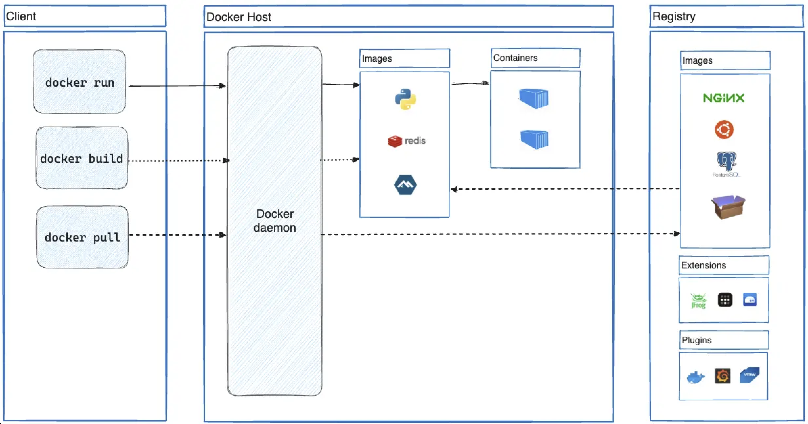
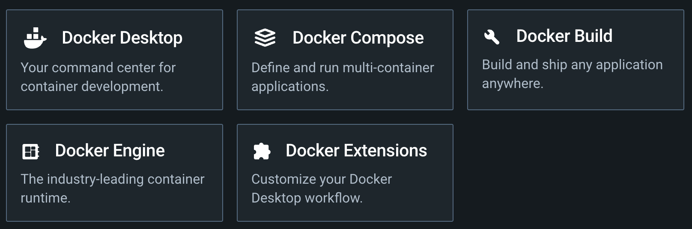
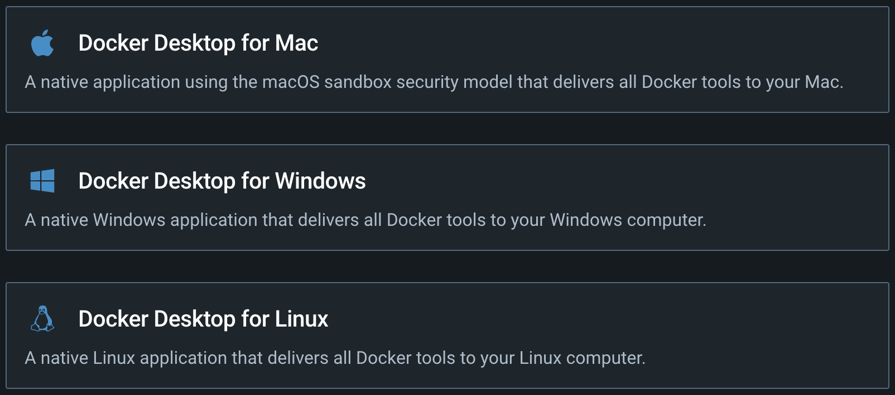
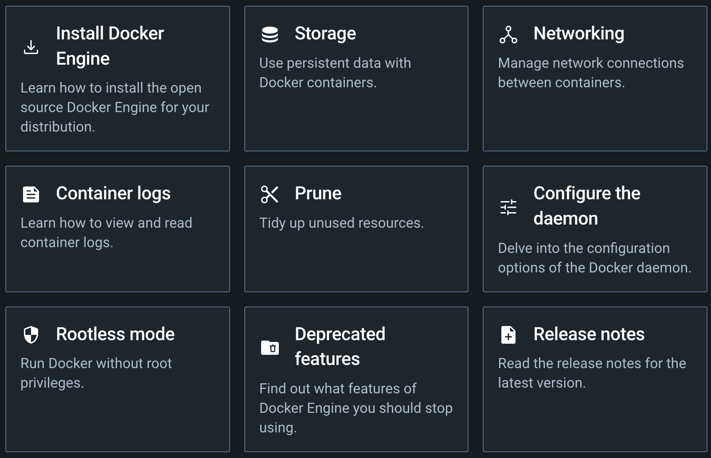
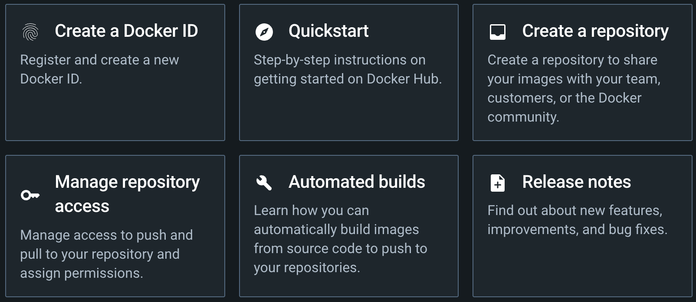

# DOCKER와 COMPOSE 알아보기

### 참조 자료 링크
> * [Docker](https://www.docker.com/)
> * [DockerHub](https://hub.docker.com/)

Docker를 이용하여 System 구축하기

</img>

---

### 1. Docker Architecture

</img>

### 2. Docker tools

</img>

### 3. Docker OS(Operating System)

</img>

### 4. Docker Engine

</img>

### 5. Docker Hub

</img>

---

### Table of Contents

#### 0. Docker 알아보기

###### [1. Docker 설치](./page1)

###### [2. Docker 기본 명령어](./page2)

###### [3. Docker 실행(Run)](./page3)

###### [4. Docker File 만들기](./page4)

###### [5. Docker File 빌드하기](./page5)

###### [6. Docker Compose 기본 명령어](./page6)

