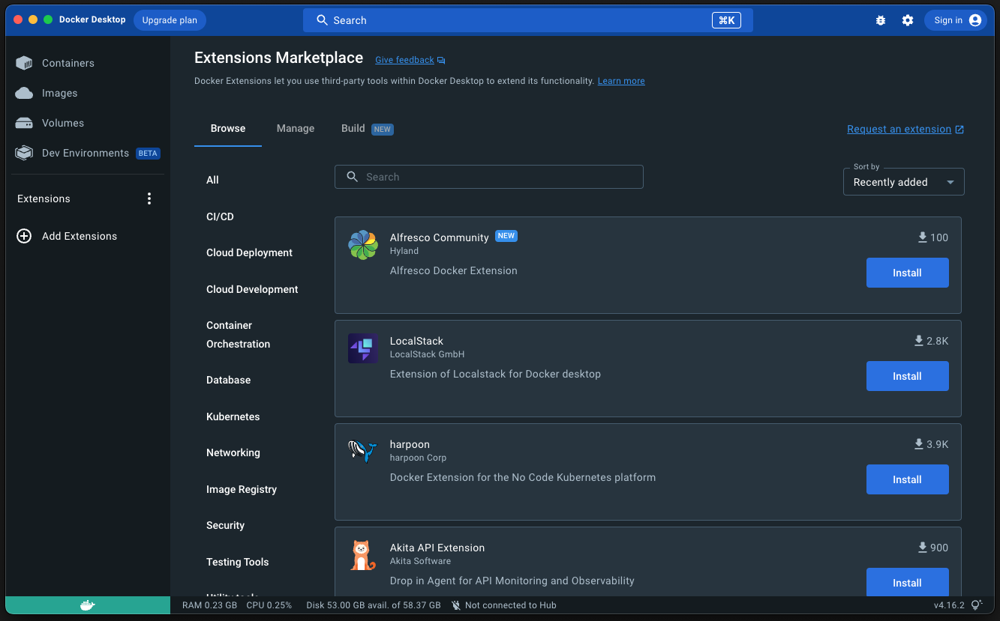

# 1. Docker 설치

### 참조 자료 링크

> - [Docker](https://www.docker.com/)

###### Download 눌러 설치 파일 받기

</img>

###### 다운 받은 dmg 파일 실행 후 Applications로 복사

</img>

###### Dashboard 실행하여 설치 상태 확인

</img>

###### 설치 후 Docker 버젼 확인

</img>

```
docker -v
```

---

### Table of Contents

###### [0. Docker 알아보기](../)

#### 1. Docker 설치

###### [2. Docker 기본 명령어](../page2)

###### [3. Docker 실행(Run)](../page3)

###### [4. Docker File 만들기](../page4)

###### [5. Docker File 빌드하기](../page5)

###### [6. Docker Compose 기본 명령어](../page6)
