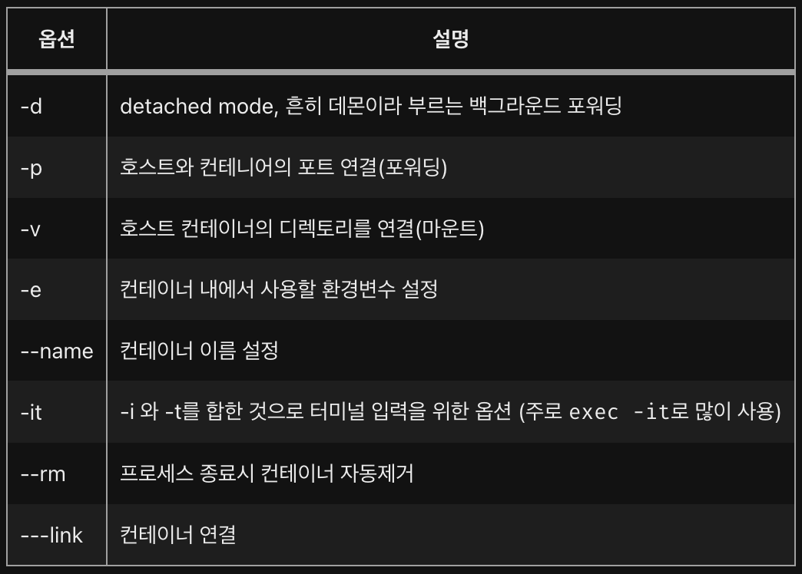

# 2. Docker 기본 명령어

### Docker CLI 명령어

* 현재 실행 중인 Docker 버젼 확인
```bash
docker --version
docker -v
```
* Docker 명령어 출력
```bash
docker --help
```
* Docker Hub에 있는 Repository의 이미지를 내려받기
```bash
docker pull [이미지명:태그명]
docker pull ubuntu:latest
```
* Docker Container 생성
```bash
docker run [옵션] [컨테이너명] [도커 이미지]
docker run -it -d --name ubuntu ubuntu:latest
```
* 실행 된 Docker Container 목록 출력
```bash
docker ps
```
* 실행 또는 정지 된 Docker Container 목록 출력
```bash
docker ps -a
```
* 실행 된 Docker Container에서 CLI 명령어 사용
```bash
docker exec [옵션] [컨테이너 이름] [CLI 명령어]
docker exec -it [컨테이너 이름] bash
```
* 실행 된 Docker Container 정지
```bash
docker stop [컨테이너 이름]
```
* 실행 된 Docker Container 강재 정지
```bash
docker kill [컨테이너 이름]
```
* 로컬에 있는 Docker Container를 Image로 만들기
```bash
docker commit [컨테이너 이름] [사용자명/이미지명]
```
* Docker Hub Repository에 로그인 할때 사용
```bash
docker login
```
* Docker Hub Repository에 이미지를 올릴때 사용
```bash
docker push [사용자명/이미지명]
```
* 로컬에 저장된 Docker Image 목록
```bash
docker images
```
* 정지된 Docker Container를 지울 때 사용
```bash
docker rm [컨테이너 ID]
docker rm --force [컨테이너 ID]
docker rm -f $(docker ps -aq)
```
* 로컬에 있는 Docker Image를 지울 때 사용
```bash
docker rmi [이미지명]
docker rmi $(docker images -q)
```
* 선택한 Docker File를 빌드하기 위해 사용
```bash
docker build [Psth to Dockerfile]
```

### Docker CLI Option

</img>

---

### Table of Contents

###### [0. Docker 알아보기](../)

###### [1. Docker 설치](../page1)

#### 2. Docker 기본 명령어

###### [3. Docker 실행(Run)](../page3)

###### [4. Docker File 만들기](../page4)

###### [5. Docker File 빌드하기](../page5)

###### [6. Docker Compose 기본 명령어](../page6)
