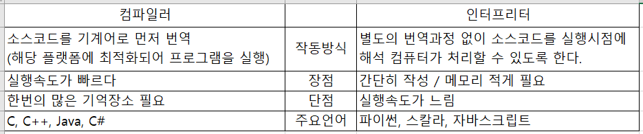
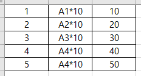
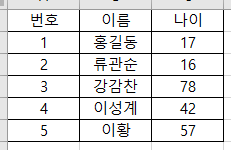

# Python 알아보기

## 파일 확장명
+ Python 파일 `*.py`
+ Jupyter Notebook `*.ipynb`

## Python이란
+ 1991년 귀도 반 로섬(Gudi Van Rossum) 발표
+ 플랫폼 독립적
+ 인터프리터 언어
+ 객체 지향 (OOP)
+ 동적 타이핑 언어

## 역사
+ 1989년 크리스마스 연휴때 초기 Python 개발
+ "Monty Python's Flying Circus" : Python 명칭 유래
+ 근무지 : 구글, DropBox 등등
+ [Gudi Van Rossum 알아보기](https://en.wikipedia.org/wiki/Guido_van_Rossum)

## 용어 및 특징
1. 플랫폼 = OS
+ 원도우, 리눅스, 안드로이드, 맥OS 등 프로그램 실행되는 운영체제를 플랫폼이라고 한다.
2. 독립적 = 관계없는, 상관없는
+ OS에 상관없이 한번 프로그램을 작성하면 사용가능
3. 인터프리터 = 통역기를 사용하는 언어
+ 소스코드를 바로 실행할 수 있게 지원 하는 프로그램 실행 방법
4. 컴파일러 vs 인터프리터
</img>
5. 설치파일 다운로드
+ [Python](https://www.python.org/downloads/)
+ [Anaconda](https://www.anaconda.com/)
+ [Jupyter](https://jupyter.org/install)
+ [VSCODE](https://code.visualstudio.com/)
+ [PyCharm](https://www.jetbrains.com/pycharm/download/?section=windows)

## 배열 문제
+ 1. 아래의 그림과 같이 1차원 배열 `[1,2,3,4,5,]`에서 각각 10을 곱하여 2차원 배열로 만드시오.

</img>

+ 2. 아래의 그림과 같이 2차원 배열에서 각 열에 대한 목록을 출력하시오.

</img>

## NumPy 설치
```cmd
pip install numpy
```
+ 다차원 분석을 위한 라이버리
+ [NumPy 공식문서](https://numpy.org/doc/stable/)

## Pandas 설치
```cmd
pip install pandas
```
+ 데이터 분석을 위한 라이버리
+ [Pandas 공식 문서](https://pandas.pydata.org/pandas-docs/stable/reference/index.html)

## BeautifulSoup 설치
```cmd
pip install beautifulsoup4
```
+ html 문서 수집
+ 웹 크롤링에 사용하는 종류 중 하나
+ [BeautifulSoup 공식문서](https://www.crummy.com/software/BeautifulSoup/)

## Streamlit 설치
```cmd
pip install streamlit
```
+ 빠르게 화면 표현 프로그램
+ 기존 html, css 이해 없이 바로 페이지 생성
+ 시각화를 위해서 차트 지원
+ [Streamlit 공식문서](https://docs.streamlit.io/)

## Selenium 설치
```cmd
pip install selenium
```
+ 자동화 프레임워크 프로그램
+ BeautifulSoup 다음으로 웹 크롤링으로 사용
+ 단점, 속도가 다른 웹 크롤링 보다 느림
+ 장점, Python 뿐만 아니고 다른 언어에서도 개발 가능
+ [Selenium 공식문서](https://www.selenium.dev/)
